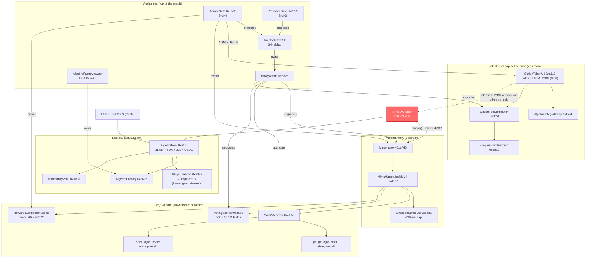

# Hydrex (HYDX) — audit source repository & trust-graph map

**Target:** `0x00000e7efa313f4e11bfff432471ed9423ac6b30` — **HydrexToken (HYDX)**, an ERC-20 on **Base**
(chainid 8453). Deployed 2025-07-16, ~7,100 holders, ~102.1M supply. HYDX is the emissions/governance
token of the Hydrex ve(3,3) DEX built on an **Algebra Integral** concentrated-liquidity AMM.

This repository is a self-contained, audit-ready snapshot of **everything that bears on HYDX's
security**: the target's own code, the full graph of contracts it reaches and that reach it (proxies
resolved to their live implementations), recovered behavior for the unverified pieces, a live on-chain
state snapshot, integrity checks of shared libraries against upstream, and an explicit list of what
remains unresolved. It was assembled by resolving the target's trust graph in **both directions** and
following the actual code, not names. Snapshot date **2026-08-16**.

> ⚠️ **This is not an exploitability assessment.** It is the evidence base for one. The goal was that
> when the audit opens this repo, nothing that could bear on HYDX's security is unread, unrecovered,
> or unnamed.

---

## Headline security posture (read this first)

HYDX's own code is a clean, unremarkable OpenZeppelin ERC-20 (`ERC20` + `Permit` + `Burnable` +
`Ownable`) whose only bespoke logic is `mint(to, amount)` and one-time `initialMint`, both
`onlyOwner`. **All of HYDX's security therefore lives in what `owner()` is wired to, and in the
separate contracts that hold power over the token without being it.** The four things an auditor
should look at hardest:

1. **Mint authority** — `owner()` is the **Minter** (`MinterUpgradeableV3Proxy 0xa7d6…` → impl
   `MinterUpgradeableV4 0xde97…`), which *can* mint HYDX without a cap in the token, but in practice
   mints only a schedule-bounded weekly emission (**≤2%/week tail**, `RevisedPhasedEmissionSchedule`).
   The unbounded path is a **timelocked (24h) upgrade** of the Minter or a swap of the emission
   schedule — gated by a 3-of-3 proposer Safe + a 2-of-4 executor Safe. See
   [§ Mint authority](#1-mint-authority-what-can-create-hydx).
2. **oHYDX (OptionTokenV4 `0xa113…`)** holds **31.06M HYDX = 30.4% of supply** (verified 1:1 backing
   on-chain), released either by paying a discounted USDC price or, via `exerciseVe`, **for free** as a
   permanent ve-lock. Its `ADMIN_ROLE` (the 2-of-4 Admin Safe) can retune the discount, the TWAP
   oracle, and the fee distributor — i.e. **how cheaply that 30% reserve leaves the contract.** This is
   the "separate contract that can sell the token cheaply" pattern. See [§ oHYDX](#2-ohydx--the-cheap-sell-surface).
3. **The $460K HYDX/USDC pool (`AlgebraPool 0x51f0…`)** and who can drain or reconfigure it — its
   factory owner (a **bare EOA**), its **upgradeable plugin/hook**, and the off-chain ALM/MEV keepers.
   See [`live-state/liquidity-analysis.md`](./live-state/liquidity-analysis.md).
4. **Upgrade & role authority** — a shared `ProxyAdmin 0x6e25…` (owned by the 24h Timelock) can replace
   the implementation of the Minter, Voter, VotingEscrow, fee distributor and more. Everything reduces
   to a small overlapping set of EOA signers. See [`live-state/AUTHORITIES.md`](./live-state/AUTHORITIES.md).

**Empirical check (not just nominal):** every privileged value-path call was simulated from an
arbitrary unprivileged address (`0xdEaD`) against current state — unprivileged `HYDX.mint`,
`oHYDX.setDiscount`/`setPaymentConfiguration`/`burn`, `RewardsDistributor.withdrawERC20`,
`Minter.setEmissionSchedule`, `Voter.setGaugeLogic`, `AlgebraFactory.transferOwnership`, and more **all
revert**; only permissionless `Minter.update_period()` succeeds (returns 0, pays only the schedule to
protocol contracts). Results: [`live-state/unprivileged-simulation.json`](./live-state/unprivileged-simulation.json).

---

## How to use this repo

- **Source tree:** [`contracts/`](./contracts/), grouped by role. Each contract lives in its own
  directory named `<ContractName>_<shortaddr>/`, extracted from Etherscan as a **complete Solidity
  standard-json input** (so each directory is independently compilable with the `solc` version in its
  `meta.json`; the bespoke file is under that project's `contracts/…` path, alongside its own copies of
  OpenZeppelin/Algebra/etc.). `meta.json` records address, compiler, proxy flag, and constructor args;
  `abi.json` is the verified ABI.
- **Live state (who holds power, balances, impls, roles):** [`live-state/`](./live-state/) — start with
  [`AUTHORITIES.md`](./live-state/AUTHORITIES.md), then `authorities.json`, `holdings.json`,
  `graph.json` (the full 76-node ledger), `ADDRESS_BOOK.md`.
- **Recovered behavior of unverified contracts:** [`recovered/`](./recovered/).
- **Integrity checks of shared libraries vs upstream:** [`integrity/`](./integrity/).
- **What is still unresolved:** [`UNRESOLVED.md`](./UNRESOLVED.md).

Categories under `contracts/`:
`target/` (HYDX) · `mint-authority/` (Minter + emission schedule) · `ve-core/` (VotingEscrow, Voter,
logic modules, rewards, bribes, gauge/eligibility) · `options/` (oHYDX, TWAP oracle, fee distributor,
floor guardian) · `liquidity/` (Algebra pool/factory/plugin/deployer, MevX/ALM, community vault,
classic pair) · `governance/` (Safes, Timelock, ProxyAdmin, permission registries) · `external/`
(canonical Circle USDC).

---

## The trust graph

### Downstream — what HYDX leans on
Almost nothing. HYDX's bytecode references **no external contract**; it inherits only OpenZeppelin
(`ERC20`, `ERC20Permit`/`EIP712`/`ECDSA`/`Nonces`, `ERC20Burnable`, `Ownable`). It is not a proxy, has
no fee-on-transfer, no blacklist, no pausing, no rebasing. The only "dependency" is its `owner()`. So
the graph is almost entirely **upstream**: the systems that hold power over the token.

### Upstream — what holds power over HYDX
This is the substance of the audit and is detailed below and in `live-state/AUTHORITIES.md`.

---

## 1. Mint authority — what can create HYDX

`HydrexToken.mint(to, amount)` and `initialMint` are `onlyOwner`; `owner()` = the Minter proxy
`0xa7d64625f45548a19b2a19e28e7546bb2839003e`.

- **Proxy shell:** [`contracts/mint-authority/MinterUpgradeableV3Proxy_0xa7d63003e`](./contracts/mint-authority/) —
  a transparent proxy; **admin = shared ProxyAdmin `0x6e25…`** (upgradeable to arbitrary code by the Timelock).
- **Live implementation:** [`MinterUpgradeableV4_0xde97d219`](./contracts/mint-authority/) — `MinterUpgradeableV4.sol`.
  The only live mint path is `update_period()` (permissionless to call, mints only the scheduled weekly
  emission and routes it: 4% to `teamRecipient` = Treasury Safe, a decaying rebase to the
  RewardsDistributor, remainder to the Voter). There is **no arbitrary-mint function** exposed even to
  the governor/team. Genesis `_initialize` is already consumed (`initialMinted = true`).
- **Emission bound:** [`RevisedPhasedEmissionSchedule_0x5aaa2727`](./contracts/mint-authority/) — ramps to a
  1.2% peak (wk 12), declines to 0.4% (wk 52), then a governance-adjustable tail **hard-capped at
  2%/week**, movable only ±0.02%/epoch. So per-week mint is code-bounded **unless** the Timelock swaps
  the schedule or upgrades the Minter (both 24h-timelocked, multisig-gated).

**Discovery note reconciled:** the raw "onlyOwner, no cap, no rate-limit" flag on `mint()` is literally
true of the token layer, and the mitigations (a real Minter with a capped schedule) live entirely in the
external system above — which is exactly why that system is fully reproduced here.

## 2. oHYDX — the cheap-sell surface

[`contracts/options/OptionTokenV4_0xa113cb78`](./contracts/options/) — `OptionTokenV4.sol` (a
Velocimeter-style option token). oHYDX **holds 31,056,181 HYDX (30.4% of total supply), verified 1:1
backed** (`live-state/holdings.json`: `backing_ratio = 1.000`). Ways that HYDX leaves this contract:

- `exercise(amount, …)` — burn oHYDX, pay `discount%` (currently **30%**) of the TWAP price in USDC to
  the fee distributor, receive HYDX. Backstopped by `getMinPrice` = max(discounted, floor).
- `exerciseVe(amount, recipient)` — burn oHYDX, receive an equivalent **permanent ve-lock, paying
  nothing**. (By design: converts an option into locked governance weight.)
- `burn(amount)` (`onlyAdmin`) — admin redeems its own oHYDX for HYDX 1:1.

**Admin power (live `ADMIN_ROLE` = Admin Safe `0x1ae3…`, 2-of-4):** `setDiscount` (1–100),
`setPaymentConfiguration` (**swap the TWAP oracle and pair**), `setFeeDistributor`, `setTwapSeconds`,
`toggleExternalOption` (whitelist an arbitrary external option contract that receives a HYDX approval in
`exerciseExternal`). These collectively tune the price at which the 30%-of-supply reserve is released.
Pricing is on-chain TWAP (no operator feed) but the TWAP is read from the pool **plugin**, which is
upgradeable — see [`live-state/OFFCHAIN.md`](./live-state/OFFCHAIN.md). Floor price is set by
`SimpleFloorGuardian 0xeb39…` (owner = Admin Safe), floor payments go to a separate Safe `0x704e…`.

## 3. ve(3,3) core (downstream of the Minter; large HYDX holders)

- [`VotingEscrowV2Upgradeable`](./contracts/ve-core/) (proxy `0x25b2…`, impl `0x0fc6…`) — **veHYDX**, holds
  **15.12M HYDX** locked. Transparent-proxy upgradeable via the Timelock ProxyAdmin.
- [`VoterV5`](./contracts/ve-core/) (proxy `0xc69e…`, impl `0x9cb9…`) — the ve(3,3) hub. **Uses two
  delegatecall-target logic contracts**, `VoterV5_GaugeLogic 0x8cf7…` and `VoterV5_ClaimLogic 0x68ed…`,
  settable by `VOTER_ADMIN`/roles on `PermissionsRegistry 0x3ea4…`. A `VOTER_ADMIN` compromise = arbitrary
  code in the Voter's storage context. The Voter does **not** hold HYDX mint rights; it distributes weekly
  emissions to gauges.
- [`RewardsDistributorV2 0x6fca…`](./contracts/ve-core/) — holds **799K HYDX** (rebase); `owner`
  (Admin Safe) can `withdrawERC20` it (`RewardsDistributorV2.sol:401`).
- Supporting, reproduced in `ve-core/`: BribeFactory (+impl), BribeV2, VeArtProxy, PoolEligibilityOracle,
  CUSTOM_POOL_DEPLOYER.

## 4. Liquidity — the value at risk

The main pool `AlgebraPool 0x51f0…` (HYDX/USDC, Algebra Integral concentrated liquidity) currently holds
**21.55M HYDX + 229.9K USDC**. Full drain/reconfiguration analysis, plugin-hook behavior, community-fee
flow, and off-chain ALM/MEV keepers are in **[`live-state/liquidity-analysis.md`](./live-state/liquidity-analysis.md)**.
Contracts reproduced under [`contracts/liquidity/`](./contracts/liquidity/): the pool, `AlgebraFactory`
(owner = **bare EOA `0x7426…`**), `AlgebraPoolDeployer`, the `AlgebraUpgradeablePlugin` (Farming+ALM+MevX;
the MevX executor/router impls are **unverified** — see `recovered/`), the plugin factory, the
`AlgebraCommunityVault`/`GaugeIncentiveCampaign`, and the classic Solidly `Pair` + `PairFees`.

## 5. Authorities & upgradeability
See **[`live-state/AUTHORITIES.md`](./live-state/AUTHORITIES.md)** for the complete live map: the 4 EOA
signers, the Admin/Treasury/Floor/Proposer Safes and their thresholds, the 24h Timelock, the shared
ProxyAdmin, both permission registries with current role holders, and the OptionToken role holders.

## 6. External dependencies
- **USDC** `0x833589fcd6edb6e08f4c7c32d4f71b54bda02913` — canonical Circle USDC on Base (FiatTokenProxy →
  `FiatTokenV2_2 0x2ce6…`), reproduced under `contracts/external/`. Upgradeable and blacklist-capable by
  **Circle**, not Hydrex; it is the pool's value leg. Treated as a trusted, well-known external.

---

## Integrity, recovered behavior, and unresolved items
- **Integrity** of shared libraries (OpenZeppelin, Algebra, Gnosis Safe, Solidly-family) vs upstream:
  [`integrity/`](./integrity/).
- **Recovered behavior** of the unverified contracts (MevX executor/router impls; the plugin
  beacon/proxy shells): [`recovered/`](./recovered/).
- **Unresolved** addresses, opaque contracts, off-chain components, and unpinned authorities:
  [`UNRESOLVED.md`](./UNRESOLVED.md).
